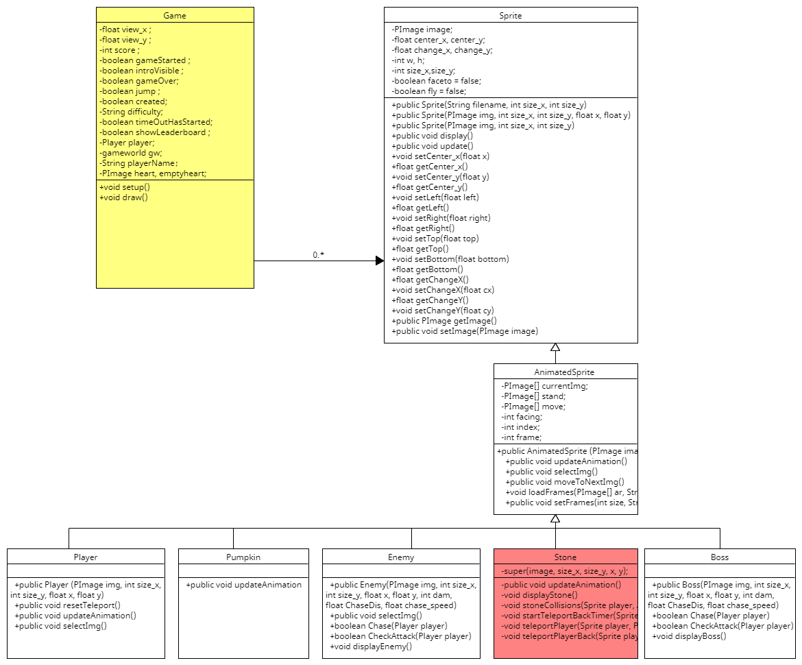

 

## Table of Contents
- [Introduction](#introduction)
- [Requirements](#requirements)
- [Design](#design)
- [Implementation](#implementation)
- [Evaluation](#evaluation)
- [Process](#process)
- [Conclusion](#conclusion)

# Introduction 
Introduction (5%  ~200 words)
Describe what makes the new level in your game novel.

The previous game was a 2D platformer with two levels, easy and hard. Like other similar 2D platformers, it allowed the character to jump through obstacles, avoid enemies and collect points. I added a medium difficulty map based on the previous game and added a new feature: the teleport stone. When the player touches the teleport stone, they will be teleported to a specified location for a period of time before being teleported back to the starting point, or they will be teleported to a specified location but not teleported back. The specific function of the teleport stone depends on whether it is the first or second time the teleport stone is touched. The first time the teleport stone is touched, the player will be teleported to a specified location for a period of time before being teleported back to the starting point. The second time the teleport stone is touched, the player will be teleported to a specified location but will not teleport back. By introducing medium difficulty, players have the opportunity to practice and improve their skills before entering more difficult levels. The teleport stone in this level adds a new mechanic that players need to master to achieve a smooth transition from easy levels to difficult levels. With the teleport stone, players can enjoy a more interesting and varied game.
 
 

  
  
GameDemoStone1 

  
 
GameDemoStone2 

 

 

# Requirements
Requirements (15% ~300 words)
List three new user stories associated with the new level. Explain why you decided to develop the new level.

**User Case Story**

- Player Navigation Using Teleport Stones
- Strategic Gameplay Using Teleport Stones
- Progressive Difficulty in Medium Difficulty

**User Story**
 
>As a player,  
>I want to use Teleport Stones to quickly navigate to different areas of the mid-level map,  
>so that I can explore new areas more efficiently and collect stashes or power-ups. Rationale: This user story highlights the need for better navigation in the >game, making it more engaging by allowing players to explore new areas faster and more >efficiently. The Teleport Stone feature adds a strategic element to the game, >making exploration more rewarding and exciting.
 

>As a player,  
>I want Teleport Stones to provide temporary repositioning to avoid powerful enemies or obstacles,  
>so that I can plan my moves better and have a higher chance of surviving challenging sections. Rationale: This user story highlights the tactical use of Teleport >Stones to avoid difficult sections in the game. With temporary repositioning, players can bypass >powerful enemies or obstacles, adding a layer of strategy to the >gameplay. This makes the mid-level more interesting and challenging.

 

>As a player,  
>I would like the difficulty of Medium Difficulty to increase gradually with the introduction of Teleport Stones,  
>so that I can improve my skills and prepare for the harder levels. Rationale: This user story addresses the need for a balanced progression in the game's >difficulty. By introducing Medium Difficulty, players have a chance to practice and improve their skills before moving on to the harder levels. The Teleport Stone in >this level adds a new mechanic that players need to master, providing a smooth transition from easy to hard levels.

 

**Reasons for Developing a New Level**
 
 
There are several motivations for developing a Medium Difficulty level with a Teleport Stone:

- Balanced Difficulty Progression:  
Introducing Medium Difficulty provides players with a smoother difficulty curve, allowing them to gradually build their skills and adapt to new game mechanics before facing more challenging levels.

- Increase Gameplay Variety:  
Teleport Stones add a unique feature that differentiates Medium Difficulty from Easy and Hard levels. This variety keeps the gameplay fresh and engaging, preventing it from becoming monotonous.

- Increase Engagement and Replayability:  
By adding new elements like Teleport Stones, players are encouraged to try different strategies and explore the game world more thoroughly. This not only increases player engagement, but also improves the replayability of the game as players come back to uncover all the secrets and refine their gameplay.

- Strategic Depth:  
The Teleport Stone introduces a strategic element to the game, requiring players to carefully consider when and where to use it. This depth enhances the overall game experience and makes it more rewarding for players who enjoy tactical games.
  
In summary, mid-level levels with Teleport Stones were developed to create a more balanced, engaging, and strategic game experience that encourages players to explore, strategize, and improve their skills.

# Design
//todo behavioural diagrams.
Design (15% ~350 words)
Explain what has changed in the system architecture, as a result of developing the new level. Show the changes in the class diagrams and behavioural diagrams.

**Paper Prototyping**

 
Teleport stone firstly touch 

**System Architecture**

**CLASS DIAGRAM**

// 加入 behavioural diagrams.

**Changes**

as a result of developing the new level：//todo
To develop the new level, the system architecture has undergone the following changes:

*New Class：*

Stone Class:
Inherits from AnimatedSprite and represents stones in the new level.
Added constructor: Initializes stone objects and loads their animation frames.
Added updateAnimation method: Updates the animation frames of the stone.
Modified and New Methods

*New Methods：*

displayStone: Displays stones on the screen and updates their animation frames.
stoneCollisions: Detects collisions between the player and stones, and teleports the player upon collision.
startTeleportBackTimer: Starts a timer to teleport the player back to the original position after a specified delay.
teleportPlayer: Teleports the player to a new specified position and starts the return timer.
teleportPlayerBack: Teleports the player back to the original position.

*Modified Existing Classes：*

Player Class:
Added attribute originalPosition: Stores the player's original position.
Added attribute isTeleported: Indicates whether the player has been teleported.
Added attribute stoneCollisionCount: Tracks the number of collisions between the player and stones.
Added attribute teleportEndTime: Records the end time of the teleport.
Added methods startTeleportTimer and getRemainingTeleportTime: Manages the teleport timing.
New Global Variables
In the Main Class:
ArrayList<Sprite> Stones: Stores all stone objects.

*New Game Logic：*

Calling displayStone in the draw Method: Ensures that stone objects are displayed and updated in the main drawing loop.
Calling stoneCollisions in the collideAll Method: Adds handling of collisions between the player and stones in the collision detection logic.

**Summary of System Architecture Changes**

New Stone Class: Introduced a new game element (stone) and created a dedicated class to handle its behavior and animation.
New Collision Handling Logic: Added logic to teleport the player when colliding with stones and return the player to the original position after a certain time.
Extended Player Class: Added attributes and methods related to teleportation to support the new game mechanic.
New Methods for Displaying and Updating Stones: Ensured proper display and animation updates for stone objects in the game.
These changes have enabled the new level to be implemented, introducing new challenges and interactions that enhance the depth and playability of the game.

# Implementation

//todo after pre
Implementation (15% ~350 words)
Describe implementation of the new level in your game, in particular highlighting  two areas of challengein developing this new level in your game.

The implementation of the new level in our game involved several critical steps, especially focusing on the introduction of new game elements and the addition of complex interaction mechanics. Below are the descriptions of two major challenges faced during the development of this new level, along with their respective solutions.
  

### Challenge 1

#### Introduction of New Game Elements and Animations

-Description:
 
The new level introduced a new game element, the stone, which has animations that need to be dynamically displayed and updated in the game.

-Specific Issues: 
Loading and managing animation frames for the stone to ensure smooth animation playback.
Correctly displaying and updating the state of stones in the main game loop.

### Solution 1

Solution: Create a Stone class inheriting from AnimatedSprite and load animation frames in its constructor.
In the displayStone method, iterate over all stone objects and call their display and update methods.

### Challenge 2

#### Collision Handling and Teleportation Logic

-Description:  
In the new level, when the player collides with a stone, a teleportation logic is triggered. This means the player is teleported to a new position and then returns to the original position after a certain delay. Implementing this feature required precise collision detection and managing multiple states and timers.

-Specific Issues: 
Ensuring accurate collision detection under various conditions.
Managing multiple states (e.g., whether the player is teleported, original position, number of collisions).
Accurately controlling the delay timer to teleport the player back to the original position, avoiding multiple teleportations or timing errors.

### Solution 2

Solution: Use the checkCollisionList method to detect collisions and call the teleportPlayer method upon collision.
Add relevant attributes (such as isTeleported and originalPosition) in the player class to manage teleportation state.
Use java.util.Timer to handle the delay logic for returning to the original position.

# Evaluation

//todo after pre
Evaluation (15% ~300 words)
One qualitative or one quantitative evaluation of your choice.
A description of how the new code was tested.

## One qualitative or one quantitative evaluation

Evaluation is fundamental in software development as it enables developers to analyze and refine the software to meet users’ requirements effectively. To ensure that this project meets users’ requirements, I chose to conduct a qualitative evaluation using the Think Aloud method.

### Think Aloud Evaluation
The Think Aloud method requires users to verbalize their thoughts and impressions while performing specified tasks. This approach provides direct insights into the user experience, highlighting potential issues and areas for improvement.

### Methodology:

**-Participants:** I recruited four participants with varying levels of gaming experience to perform the Think Aloud evaluation. 

**-Tasks:** Participants were asked to play the new level, focusing particularly on collecting pumpkins and navigating through the level. 

**-Procedure:** During gameplay, participants were instructed to verbalize their thoughts, describe their actions, and express any confusion or difficulties they encountered. A facilitator was present to prompt participants if they became silent, ensuring continuous verbal feedback. 

### Data Collection and Categorization: 

**-Raw Data:**  The verbal feedback from participants was recorded and transcribed. 
**-Categorization:** The transcribed data was then categorized into four main categories: “Nothing to be addressed,” “Issues to be addressed,” “Issues to be discussed,” and “Uncertain.” 
**-Nothing to be addressed:** Feedback indicating positive aspects or areas with no issues. 
**-Issues to be addressed:** Clear issues or bugs that need immediate attention and fixing. 
**-Issues to be discussed:** Ambiguous feedback that could either be a bug or an intended feature, requiring further discussion among the development team. 
**-Uncertain:** Feedback that was unclear or not directly actionable. 

### Results:  
**-Positive Feedback:**  Participants appreciated the new animations and the teleportation mechanics, noting that these elements added depth and excitement to the gameplay. 
**-Issues Identified:**  
Collision Detection: Some participants reported inconsistent collision detection with the stones, leading to unexpected teleportations. 
Difficulty Balance: A few participants found the level either too easy or too difficult, indicating a need to reassess the difficulty settings. 
Teleportation Timing: Some participants were unsure when they would be teleported back to the original position, suggesting the need for a teleportation timer. 
Visual Clarity:  There were comments about certain visual elements being unclear or hard to distinguish, affecting the overall user experience. 

### Improvements:  

Based on the Think Aloud evaluation, we made several adjustments: 
- Refined the collision detection algorithm to ensure consistent interactions with the stones. 
- Adjusted the difficulty settings to provide a more balanced experience for players of different skill levels. 
- Enhanced the visual clarity of key elements to improve the overall user experience. 
- Added a teleportation timer to clearly indicate when the player would be teleported back, improving user awareness and reducing confusion. 

By incorporating feedback from the Think Aloud evaluation, we were able to identify and address critical issues, leading to a more polished and user-friendly game. 

## Testing of the new code

To ensure the functionality and stability of the new code, I performed the following tests:

**Functional testing**
 
Purpose: Ensure that the new level and all its features work properly.
Method: Manual testing includes the complete process of player collision with stones, teleportation logic, and returning to the original position. Automated testing uses simulated player input to verify game behavior.
Result: All functional tests passed, confirming that the logic and interaction of the new level are as expected.

**Regression testing** 
Purpose: Ensure that the introduction of new code does not break existing functionality.
Method: Rerun all existing test cases after introducing the new level, especially those involving player movement, collision detection, and game state management.
Result: All regression tests passed, confirming that the new code did not introduce new problems.

**Performance testing** 
Purpose: Verify the performance of the new level and ensure that the frame rate and memory usage are within a reasonable range.
Method: Run the game for a long time, especially scenes with multiple animated stones and background music, and monitor the frame rate and memory usage.
Result: The game performance remains stable after the introduction of the new level, and the frame rate and memory usage are as expected.

 

**Conclusion** 
Through the above evaluation and testing, the smooth integration of the new level was ensured, and its impact on the overall game performance was verified to be within an acceptable range, providing players with a smooth and stable gaming experience.

# Process

//todo before pre
Process (15% ~200 words)
Reflect on your work process, in particular:
explaining what tools you used and their strengths and limitations

agile sprint kanban board paperprototying  giphy
  

//todo after pre
how different it would have been working in a team rather than working on your own? 
how you could have improved your performance in the previous team work. 

# Conclusion
//todo after pre
Conclusion (10% ~200 words)
Describe what lessons you have learnt about software engineering by completing this individual work? 
Reflect on the challenges you faced in completing this work. 
Describe how you could develop the software further in the future.

